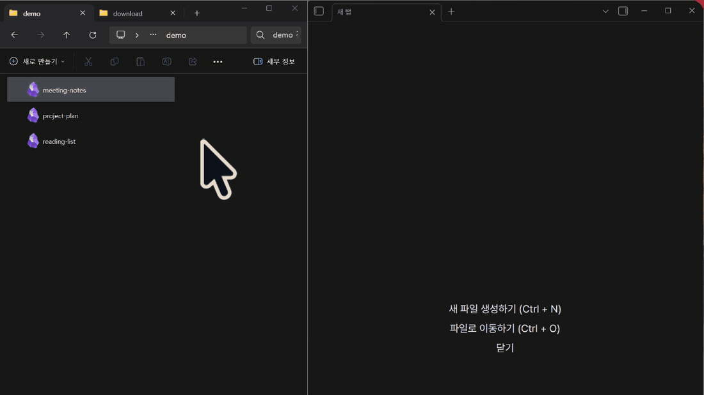

# obsidian-doubleclick

### `.md` 더블클릭해도 옵시디언에서 그 파일이 안 열리는 문제, 이걸로 해결됨

**Windows · macOS** · exe 하나 3.4MiB / 앱 하나 328KB · .NET·Node.js·플러그인 **전부 불필요**

[](https://github.com/ahnbu/obsidian-doubleclick/releases/latest)
[](https://github.com/ahnbu/obsidian-doubleclick/releases)
[](LICENSE)


[English README](README.md)



<sub>옵시디언이 이미 실행 중인 상태다. 꺼져 있으면 더 걸린다 — [문제 해결](#문제-해결) 참고.</sub>

---

## 이 문제 겪어봤다면

`.md` 기본 앱을 옵시디언으로 잡아두고 노트를 더블클릭했는데, **클릭한 파일은 안 열리고 마지막 워크스페이스만 뜬 적** 있을 거다.

설정이 잘못된 게 아니다. 옵시디언은 Electron 앱이라 윈도우가 넘겨주는 파일 경로(`Obsidian.exe "%1"`)를 무시한다.

이건 [2020년 5월부터 열려 있는 최다 요청 이슈](https://forum.obsidian.md/t/have-obsidian-be-the-handler-of-md-files-add-ability-to-use-obsidian-as-a-markdown-editor-on-files-outside-vault-file-association/314)다 — 좋아요 111개, 댓글 167개, 지금도 미해결.

맥도 똑같다. 옵시디언은 `.md`를 여는 앱으로 스스로를 등록하지 않아서 「다음으로 열기」 목록에도 안 나오고, `open -a Obsidian 노트.md`로 넘겨도 원래 보던 탭만 앞으로 온다 — macOS 26.6, 옵시디언 1.13.7에서 실측.

그래서 해결은 옵시디언 바깥에 있어야 한다. 탐색기(맥은 Finder)와 옵시디언 사이에 끼어서 파일 경로를 `obsidian://` URI로 번역해주는 작은 프로그램 — 이게 그거다.

## 왜 플러그인이 아닌가

플러그인은 여기에 손이 닿지 않기 때문이다. Windows 파일 연결은 레지스트리에 있고, 그건 옵시디언 **바깥**이다. 플러그인 코드가 도는 시점엔 이미 옵시디언이 내 파일 없이 실행된 뒤다. [6년짜리 그 스레드](https://forum.obsidian.md/t/have-obsidian-be-the-handler-of-md-files-add-ability-to-use-obsidian-as-a-markdown-editor-on-files-outside-vault-file-association/314)에서 레지스트리 해킹과 래퍼 스크립트만 나오고 플러그인은 안 나온 이유다.

[Mononote](https://github.com/czottmann/obsidian-mononote) 같은 플러그인은 다른 문제를 푼다 — **이미 옵시디언 안에 들어온 뒤** 노트당 탭 하나를 유지하는 것. 이 도구와 겹치거나 충돌하지 않는다. 어디서든 그 탭 동작을 원하면 둘 다 쓰면 된다.

## 기존 우회안과 뭐가 다른가

Windows에서 이 문제를 푸는 현실적인 선택지는 이 셋이다.

| | **obsidian-doubleclick** | [ObsidianShell](https://github.com/Chaoses-Ib/ObsidianShell) | 직접 짠 스크립트 (포럼 레시피) |
|---|---|---|---|
| 먼저 깔아야 하는 것 | ✅ 없음 | ❌ .NET 런타임 | ⚠️ AHK 방식이면 AutoHotkey |
| 옵시디언 플러그인 필요 | ✅ 불필요 | ✅ 불필요 | ❌ 대개 Advanced URI 필요 |
| 볼트 여러 개 켜뒀을 때 올바른 창 선택 | ✅ 됨 | ❌ 안 됨 | ❌ 안 됨 |
| 이미 열린 노트를 새로 열지 않고 포커스 | ⚠️ Advanced URI 필요 | ❌ 안 됨 | ⚠️ 레시피가 Advanced URI를 쓸 때만 |
| 볼트 외부 파일 | ✅ 에디터 자동 감지 폴백 | ⚠️ 설정 필요 | ⚠️ 일부 레시피는 볼트 경로로 분기 |
| 전부 읽어볼 수 있는 분량인가 | ⚠️ Go 900줄 | ❌ C# 애플리케이션 | ✅ 대개 30줄 미만 |
| 계속 유지보수되나 | ✅ 진행 중 | ❌ 2024년 7월 이후 없음 | ⚠️ 내가 관리 |

> 정렬 기준: 설치 여부를 실제로 좌우하는 순서 — 먼저 뭘 깔아야 하는가 → 제대로 동작하는가 → 편의 기능 → 얼마나 믿어야 하는가.

스크립트를 짤 수 있다면 직접 짜는 게 진짜로 좋은 답이다. 짧고, 내 것이고, 아무도 나를 버릴 수 없다. 이 도구는 **그러고 싶지 않은 경우**를 위한 것이다.

맥에서는 포럼에 AppleScript/Automator 앱으로 파일을 `obsidian://` URI로 바꾸는 방법이 나와 있다. 이 도구와 같은 발상이고, 직접 만들 수 있다면 충분히 좋은 답이다. 여기 맥 버전이 더하는 것은 Windows와 같은 자동 판정(Advanced URI 유무, 볼트 밖 파일의 폴백 편집기)과 경로 예외(한글 파일명, 이름 속 `%`·`#`·`&`·`+`, 중첩 볼트)에 대한 테스트다.

---

## 동작 방식

```
.md 더블클릭
  └─ obsidian-doubleclick.exe "%1"
       ├─ vault 내부 파일 → 옵시디언에서 열기
       │    ├─ Advanced URI 플러그인 켜짐 → 이미 열린 노트면 그 탭으로 포커스,
       │    │                               아니면 새 탭 (중복 탭 방지)
       │    └─ 플러그인 없음            → 공식 URI로 새 탭에 열기
       └─ vault 외부 파일 → Typora → VS Code → 메모장 순 자동 감지
```

- vault 목록을 `%APPDATA%\Obsidian\obsidian.json`에서 자동 읽음 (하드코딩 불필요)
- **vault를 여러 개 켜두면 해당 vault의 창을 골라서** 앞으로 가져옴
- Obsidian 업데이트 후 `.md` 연결 command, 아이콘, 앱 이름이 틀어지면 더블클릭 시 안전 항목만 자동 복구
- 콘솔 창 깜빡임 없음 (`-H=windowsgui` 빌드)
- 실행 로그: `%TEMP%\obsidian-doubleclick.log`

**맥에서는** 같은 로직이 작은 앱 `ObsidianDoubleclick.app`으로 동작한다. Finder가 파일을 넘기면 같은 `obsidian://` URI를 만들어 넘기고 바로 종료한다 — Dock 아이콘도 창도 없다. 볼트 밖 파일은 Typora → VS Code → TextEdit 순으로 연다. 볼트 목록은 `~/Library/Application Support/obsidian/obsidian.json`에서 읽고, 한글 파일명(NFC/NFD 정규화 차이), 대소문자 무시 경로, `/private` 심볼릭 링크를 처리한다.

---

## 설치

### 필요한 것

- Windows 10 / 11, **또는** 애플 실리콘 맥의 macOS 12 이상 (맥 버전은 arm64 전용)
- 옵시디언
- *(선택)* [Advanced URI 플러그인](https://obsidian.md/plugins?id=obsidian-advanced-uri) — **없어도 동작함.** 이미 열려 있는 노트를 새로 여는 대신 그 탭으로 포커스하고 싶을 때만 필요

> **exe에 코드 서명이 없음.** 처음 실행하면 Windows SmartScreen 경고가 뜬다. 남의 바이너리를 그냥 받기 꺼려지면 [직접 빌드](#직접-빌드)하면 된다 — 외부 의존성 없는 Go 900줄이고 명령 한 줄이면 끝난다.

### 설치 순서 (Windows)

> **순서 중요**: Windows 기본 앱 설정을 먼저 하고 설치 스크립트를 실행해야 함.
> 반대로 하면 Windows가 레지스트리 값을 덮어씀.

**① .md 기본 앱을 Obsidian으로 설정**

Windows 설정 → 앱 → 기본 앱 → `.md` 검색 → **Obsidian** 선택

**② Releases에서 파일 다운로드**

[GitHub Releases](../../releases/latest) 에서 `obsidian-doubleclick.exe`와 `install.ps1`을 **같은 폴더**에 받기

**③ 설치 스크립트 실행**

```powershell
powershell -ExecutionPolicy Bypass -File install.ps1
```

이렇게 뜨면 완료:

```
✅ obsidian-doubleclick (Go) 설치 완료
  Command : "C:\...\obsidian-doubleclick.exe" "%1"
✅ .md 기본 앱: Applications\Obsidian.exe — 준비 완료
```

**④ 확인**

탐색기에서 vault 안의 `.md` 파일 더블클릭 → 옵시디언 새 탭으로 열리면 완료.

### 설치 순서 (macOS)

**① 다운로드** — [Releases](../../releases/latest)에서 `obsidian-doubleclick-macos.zip`을 받아 풀고, `ObsidianDoubleclick.app`을 `~/Applications`(또는 `/Applications`)로 옮긴다.

**② 실행 허용** — 애플 공증 없이 ad-hoc 서명만 한 앱이라, 인터넷에서 받은 사본은 Gatekeeper가 막는다(`spctl` 판정 `rejected`). 다운로드 표시를 한 번 지운다:

```bash
xattr -dr com.apple.quarantine ~/Applications/ObsidianDoubleclick.app
```

남의 바이너리가 꺼려지면 [직접 빌드](#직접-빌드)하면 된다 — Swift 470줄 정도, 스크립트 하나.

**③ `.md` 기본 앱으로 지정**

```bash
~/Applications/ObsidianDoubleclick.app/Contents/MacOS/obsidian-doubleclick --set-default
```

`SET-DEFAULT ok … after=io.github.ahnbu.obsidian-doubleclick`가 나오면 된다. macOS가 변경을 확인하는 창을 띄우면 Obsidian Doubleclick을 쓰겠다고 고른다. Finder로 해도 된다: 아무 `.md` 선택 → **정보 가져오기** → **다음으로 열기** → Obsidian Doubleclick → **모두 변경…**

**④ 확인** — vault 안의 `.md`를 더블클릭해 옵시디언에서 열리면 완료.

> macOS 26.6 / 옵시디언 1.13.7, 볼트 1개 환경에서 검증: Finder로 열기, 옵시디언이 켜져 있을 때와 꺼져 있을 때, Advanced URI와 공식 URI, 볼트 밖 파일. 볼트 여러 개를 동시에 켠 상황은 맥에서 검증하지 않았고, 맥 버전에는 창 선택 로직이 없다 — URI를 어느 창이 받을지는 옵시디언이 정한다.

---

## 설정 (선택)

`obsidian-doubleclick.exe`와 같은 폴더에 `obsidian-doubleclick.config.json` 생성:

```json
{
  "uriMode": "auto",
  "fallbackCommand": "C:\\Program Files\\Typora\\Typora.exe",
  "obsidianExePath": "C:\\Program Files\\Obsidian\\Obsidian.exe"
}
```

| 항목 | 기본값 | 설명 |
|------|------|------|
| `uriMode` | `auto` | `auto`는 해당 vault에서 Advanced URI가 켜져 있는지 보고 알아서 고른다. `adv-uri` 또는 `official`로 강제 지정 가능 |
| `fallbackCommand` | 자동 감지 | vault 외부 파일을 열 앱 경로. 미설정 시 Typora → VS Code → 메모장 순 |
| `obsidianExePath` | 자동 감지 | 옵시디언이 흔치 않은 경로에 설치된 경우에만 필요 |

### uriMode가 하는 일

`auto`는 `<vault>/.obsidian/community-plugins.json`을 읽어 Advanced URI가 **활성화**돼 있는지(설치만 된 게 아니라) 확인하고 방식을 고른다.

| | `adv-uri` (플러그인 켜짐) | `official` (플러그인 없음) |
|---|---|---|
| 파일 열기 | ✅ | ✅ |
| 새 탭으로 열기 | ✅ | ✅ |
| 이미 열린 노트면 그 탭으로 포커스 | ✅ | ❌ 탭이 하나 더 생김 |

파일을 못 읽으면 항상 동작하는 공식 URI로 폴백한다.

### macOS 설정

`~/Library/Application Support/obsidian-doubleclick/config.json` 생성:

```json
{
  "uriMode": "auto",
  "fallbackApp": "com.microsoft.VSCode"
}
```

| 항목 | 기본값 | 설명 |
|------|------|------|
| `uriMode` | `auto` | Windows와 같다 |
| `fallbackApp` | 자동 감지 | 볼트 밖 파일을 열 앱. 번들 ID(`com.microsoft.VSCode`) 또는 앱 경로(`/Applications/Typora.app`). 미설정 시 Typora → VS Code → TextEdit 순. 옵시디언과 이 앱 자신은 폴백으로 쓰지 않는다 |

---

## 문제 해결

**아무 반응이 없어요** → 로그 파일 확인: `%TEMP%\obsidian-doubleclick.log` (맥: `~/Library/Logs/obsidian-doubleclick.log`)

**맥에서 앱이 안 열려요** → 다운로드 표시가 남아 있는 것이다. [설치 순서 (macOS)](#설치-순서-macos)의 `xattr -dr com.apple.quarantine …` 명령을 실행한다

**"advanced-uri" 오류가 떠요** → config에 `uriMode`를 `adv-uri`로 강제해뒀는데 플러그인이 꺼져 있는 경우다. `auto`로 바꾸거나 지우면 자동으로 공식 URI를 쓴다

**파일 아이콘이 이상해졌어요** → vault 안의 `.md`를 한 번 더블클릭하거나 `.\obsidian-doubleclick.exe --repair` 실행. 그래도 안 되면 `install.ps1` 재실행

**vault 외부 파일이 안 열려요** → `obsidian-doubleclick.config.json`에 `fallbackCommand` 직접 지정

**Lazy Plugin Loader 쓰는데 Advanced URI가 안 먹어요** → [Lazy Plugin Loader](https://github.com/alangrainger/obsidian-lazy-plugins)는 플러그인 로딩을 지연시키는데, 이 핸들러는 `community-plugins.json`만 읽는다. 그 파일은 **"켜져 있음"은 알려주지만 "이미 로딩됐음"은 알려주지 않는다.** URI가 도착한 시점에 Advanced URI가 아직 안 떴으면 요청이 그냥 씹힌다. **Lazy Loader 설정에서 Advanced URI를 `instant`로 두면 된다** — 나머지 전부의 입구라서 지연 대상이 아니다. 아니면 config에 `"uriMode": "official"`을 넣어 플러그인을 우회해도 된다.

**옵시디언이 꺼져 있을 때 몇 초씩 걸려요** → 핸들러가 아니라 옵시디언 콜드 스타트다. 실측해보면 **창 자체는 약 1초 만에 뜬다.** 다만 빈 창으로 떠서 내용이 채워지는 데 한참 걸린다 — 볼트 인덱싱 + 플러그인 로딩. 즉 체감하는 대기는 창이 만들어지는 시간이 아니라 **채워지는 시간**이다.

이건 이 핸들러가 어떻게 해도 못 줄인다. [Lazy Plugin Loader](https://github.com/alangrainger/obsidian-lazy-plugins)는 그중 플러그인 로딩 쪽만 도와주고, 볼트가 크면 인덱싱이 지배적이다. 핸들러는 콜드 스타트일 때 창을 더 오래(30초, 이미 떠 있으면 3초) 기다려 먼저 포기하지 않도록만 한다. 로그의 `mode=`·`elapsed=`로 어느 경로였는지 확인할 수 있다

**연결 상태를 직접 점검하고 싶어요**:

```powershell
.\obsidian-doubleclick.exe --doctor
.\obsidian-doubleclick.exe --repair
```

`--repair`는 `.md` 기본 앱 자체를 강제로 바꾸지 않고, handler command, Obsidian 아이콘, 앱 이름만 복구함.

---

## 직접 빌드

```bash
git clone https://github.com/ahnbu/obsidian-doubleclick
cd obsidian-doubleclick

# 배포용 (콘솔 창 없음)
go build -ldflags "-H=windowsgui" -o obsidian-doubleclick.exe .

# 디버그용 (콘솔 창 있음, --debug 플래그 사용 가능)
go build -o obsidian-doubleclick-debug.exe .
```

Go 1.20+ 필요. 외부 의존성 없음.

**macOS**

```bash
./macos/build.sh
```

Xcode Command Line Tools만 있으면 된다(`xcode-select --install`). 테스트 → 빌드 → `macos/build/ObsidianDoubleclick.app` 조립 → ad-hoc 서명 → zip까지 한 번에 한다. 유니버설(arm64 + x86_64) 빌드를 시도하고, x86_64 링크가 실패하면 arm64 전용으로 진행한다 — macOS 26에 딸린 Command Line Tools에서는 실패한다.

```bash
# 볼트 감지 확인 (열지 않고 URI만 출력)
~/Applications/ObsidianDoubleclick.app/Contents/MacOS/obsidian-doubleclick --debug ~/vault/노트.md
```

```bash
# 볼트 감지 확인
obsidian-doubleclick-debug.exe --debug "C:\path\to\file.md"

# 연결 상태 확인
obsidian-doubleclick-debug.exe --doctor
```

---

## 제거

`install.ps1`이 `.backup/` 폴더에 이전 설정을 백업해둬. 복구하려면:

```powershell
$backup = Get-ChildItem ".backup\backup_*.json" | Sort-Object Name | Select-Object -Last 1 | Get-Content | ConvertFrom-Json
Set-ItemProperty "HKCU:\Software\Classes\Applications\Obsidian.exe\shell\open\command" -Name "(default)" -Value $backup.previousCommand
```

또는 Windows 설정에서 `.md` 기본 앱을 다른 앱으로 바꾸면 됨.

**macOS**

1. `.md`를 다른 앱에 돌려준다: 아무 `.md` 선택 → **정보 가져오기** → **다음으로 열기** → TextEdit(또는 쓰던 편집기) → **모두 변경…**
2. `ObsidianDoubleclick.app`을 지운다.
3. 필요하면 `~/Library/Application Support/obsidian-doubleclick/`과 `~/Library/Logs/obsidian-doubleclick.log`도 지운다.

---

## 라이선스

MIT — [LICENSE](LICENSE) 참조
