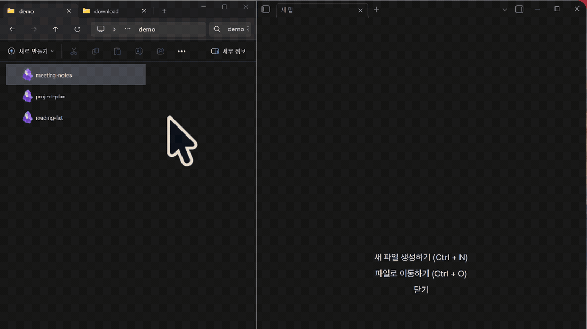

# obsidian-doubleclick

### Double-clicking a `.md` file doesn't open it in Obsidian. This fixes that.

**Windows only** · one 3.4 MiB exe · no .NET, no Node.js, **no Obsidian plugin required**

[](https://github.com/ahnbu/obsidian-doubleclick/releases/latest)
[](https://github.com/ahnbu/obsidian-doubleclick/releases)
[](LICENSE)


[한국어 README](README.ko.md)



<sub>Obsidian already running. Cold start takes longer — see [Troubleshooting](#troubleshooting).</sub>

---

## The problem

Set Obsidian as the default app for `.md`, double-click a note, and Obsidian opens — but **not the file you clicked.** You get your last workspace instead.

This is not a bug in your setup. Obsidian is an Electron app that ignores the file path Windows hands it (`Obsidian.exe "%1"`), and it has been the [most-requested unfixed issue since May 2020](https://forum.obsidian.md/t/have-obsidian-be-the-handler-of-md-files-add-ability-to-use-obsidian-as-a-markdown-editor-on-files-outside-vault-file-association/314) — 111 likes, 167 replies, still open.

The only reliable workaround is a small program that sits between Explorer and Obsidian and translates the file path into an `obsidian://` URI. That is what this is.

---

## What it does

```
double-click note.md
  └─ obsidian-doubleclick.exe "note.md"
       ├─ file is inside a vault  → opens in Obsidian
       │    ├─ Advanced URI plugin installed → focuses the tab if already open,
       │    │                                   new tab otherwise (no duplicates)
       │    └─ no plugin          → opens in a new tab via the official URI
       └─ file is outside a vault → Typora → VS Code → Notepad (auto-detected)
```

- Reads your vault list from `%APPDATA%\Obsidian\obsidian.json` — nothing to hardcode
- Brings **the right vault's window** to the front when you have several open
- No console window flash (`-H=windowsgui` build)
- Repairs the `.md` association if an Obsidian update clobbers it
- Logs every run to `%TEMP%\obsidian-doubleclick.log`

## Why isn't this a plugin?

Because a plugin cannot reach this. Windows file association lives in the registry, outside Obsidian — by the time any plugin code runs, Obsidian has already been launched without your file. That is why [six years of this thread](https://forum.obsidian.md/t/have-obsidian-be-the-handler-of-md-files-add-ability-to-use-obsidian-as-a-markdown-editor-on-files-outside-vault-file-association/314) has produced registry hacks and wrapper scripts but no plugin.

Plugins like [Mononote](https://github.com/czottmann/obsidian-mononote) solve a different problem — keeping one tab per note **once you are already inside Obsidian**. This tool and those plugins don't overlap or conflict; if you want the tab behaviour everywhere, use both.

## How it compares

If you're deciding how to fix this on Windows, these are the realistic options.

| | **obsidian-doubleclick** | [ObsidianShell](https://github.com/Chaoses-Ib/ObsidianShell) | DIY script (forum recipes) |
|---|---|---|---|
| What you must install first | ✅ nothing | ❌ .NET runtime | ⚠️ AutoHotkey for the AHK ones |
| Obsidian plugin required | ✅ no | ✅ no | ❌ most recipes need Advanced URI |
| Opens the right window when several vaults are open | ✅ yes | ❌ no | ❌ no |
| Focuses an already-open note instead of duplicating it | ⚠️ needs Advanced URI | ❌ no | ⚠️ only if the recipe uses Advanced URI |
| Files outside any vault | ✅ auto-detected fallback editor | ⚠️ configurable | ⚠️ some recipes branch on vault path |
| Small enough to read end to end | ⚠️ ~900 lines of Go | ❌ a full C# application | ✅ usually under 30 lines |
| Still maintained | ✅ yes | ❌ last update July 2024 | ⚠️ yours to maintain |

> Rows are ordered by what actually decides whether you install: what you have to install first, then whether it does the right thing, then conveniences, then how much you have to trust.

A DIY script is a genuinely good answer if you can write one — it's short, it's yours, and nobody can abandon it on you. This exists for the case where you'd rather not.

---

## Requirements

- Windows 10 / 11
- Obsidian
- *(Optional)* [Advanced URI plugin](https://obsidian.md/plugins?id=obsidian-advanced-uri) — only needed if you want an already-open note to be focused instead of opened again

> **The executable is not code-signed.** Windows SmartScreen will warn you the first time. If you would rather not trust a stranger's binary, [build it yourself](#build-from-source) — it is ~900 lines of dependency-free Go and takes one command.

---

## Install

> **Order matters.** Set the Windows default app *first*, then run the installer. Doing it the other way round lets Windows overwrite the registry entry.

**1. Make Obsidian the default app for `.md`**

Settings → Apps → Default apps → search `.md` → choose **Obsidian**

**2. Download**

Grab `obsidian-doubleclick.exe` and `install.ps1` from [Releases](../../releases/latest) and put them **in the same folder**.

**3. Run the installer**

```powershell
powershell -ExecutionPolicy Bypass -File install.ps1
```

You should see:

```
✅ obsidian-doubleclick installed
  Command : "C:\...\obsidian-doubleclick.exe" "%1"
✅ .md default app: Applications\Obsidian.exe — ready
```

The installer writes to `HKCU` only — **no administrator rights needed** — and backs up your previous association to `.backup/`.

**4. Check**

Double-click any `.md` file inside a vault. It should open in Obsidian.

---

## Configuration (optional)

Create `obsidian-doubleclick.config.json` next to the executable:

```json
{
  "uriMode": "auto",
  "fallbackCommand": "C:\\Program Files\\Typora\\Typora.exe",
  "obsidianExePath": "C:\\Program Files\\Obsidian\\Obsidian.exe"
}
```

| Key | Default | Meaning |
|---|---|---|
| `uriMode` | `auto` | `auto` detects whether Advanced URI is enabled in that vault. Force it with `adv-uri` or `official` |
| `fallbackCommand` | auto-detect | Which editor opens files that live outside any vault. Falls back to Typora → VS Code → Notepad |
| `obsidianExePath` | auto-detect | Only needed if Obsidian is installed somewhere unusual |

### About `uriMode`

`auto` reads `<vault>/.obsidian/community-plugins.json` to see whether Advanced URI is **enabled** (not merely installed) and picks accordingly:

| | `adv-uri` (plugin enabled) | `official` (no plugin) |
|---|---|---|
| Opens the file | yes | yes |
| Opens in a new tab | yes | yes |
| Focuses the tab if the note is already open | yes | no — you get a second tab |

If the file cannot be read for any reason, it falls back to the official URI, which always works.

---

## Troubleshooting

**Nothing happens** → check `%TEMP%\obsidian-doubleclick.log`. Every run is logged with the URI it built and which window it activated.

**The file icon looks wrong** → double-click any `.md` inside a vault once, or run `obsidian-doubleclick.exe --repair`. If that does not help, re-run `install.ps1`.

**Files outside my vault do not open** → set `fallbackCommand` explicitly in the config.

**I want to inspect the current state**

```powershell
.\obsidian-doubleclick.exe --doctor
.\obsidian-doubleclick.exe --repair
```

`--repair` never changes which app owns `.md`. It only restores the handler command, the Obsidian icon, and the friendly app name.

**I use Lazy Plugin Loader and Advanced URI stopped working** → [Lazy Plugin Loader](https://github.com/alangrainger/obsidian-lazy-plugins) delays plugin loading, but this handler only reads `community-plugins.json`, which says *enabled* without saying *loaded yet*. If Advanced URI hasn't finished loading when the URI arrives, the request is dropped. **Set Advanced URI to `instant` in Lazy Loader's settings** — it's the entry point for everything else, so it shouldn't be deferred. Alternatively set `"uriMode": "official"` in the config to bypass the plugin entirely.

**It takes several seconds when Obsidian isn't already running** → that's Obsidian's cold start, not the handler. Measured on a cold launch: the window appears in about **1 second**, but it comes up empty and takes considerably longer to fill in — vault indexing plus plugin loading. So the wait you feel is the window being populated, not the window being created.

Nothing this handler does can speed that up. [Lazy Plugin Loader](https://github.com/alangrainger/obsidian-lazy-plugins) helps only with the plugin-loading half; on a large vault, indexing dominates. The handler does wait longer for the window on a cold start (30 s, versus 3 s when Obsidian is already running) so it never gives up early — `mode=` and `elapsed=` in the log tell you which path a run took.

**I want to see what URI it would build, without opening anything**

```powershell
.\obsidian-doubleclick-debug.exe --debug "C:\path\to\note.md"
```

---

## Build from source

```bash
git clone https://github.com/ahnbu/obsidian-doubleclick
cd obsidian-doubleclick

# release build (no console window)
go build -ldflags "-H=windowsgui" -o obsidian-doubleclick.exe .

# debug build (console window, --debug works)
go build -o obsidian-doubleclick-debug.exe .

go test ./...
```

Go 1.20+. No external dependencies — standard library and `syscall` only.

---

## Uninstall

Change the default app for `.md` in Windows Settings, or restore the backed-up association:

```powershell
$backup = Get-ChildItem ".backup\backup_*.json" | Sort-Object Name | Select-Object -Last 1 | Get-Content | ConvertFrom-Json
Set-ItemProperty "HKCU:\Software\Classes\Applications\Obsidian.exe\shell\open\command" -Name "(default)" -Value $backup.previousCommand
```

---

## License

MIT — see [LICENSE](LICENSE).
